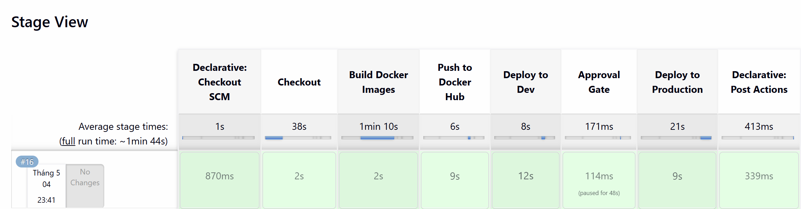
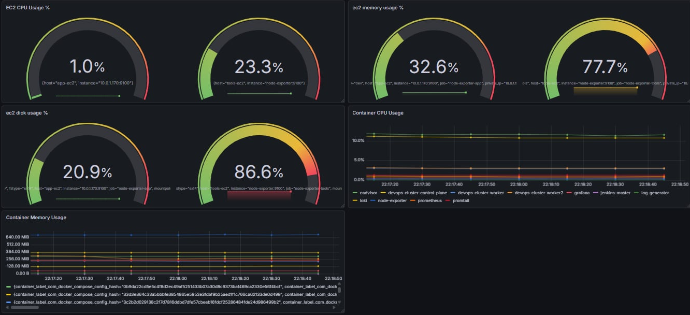
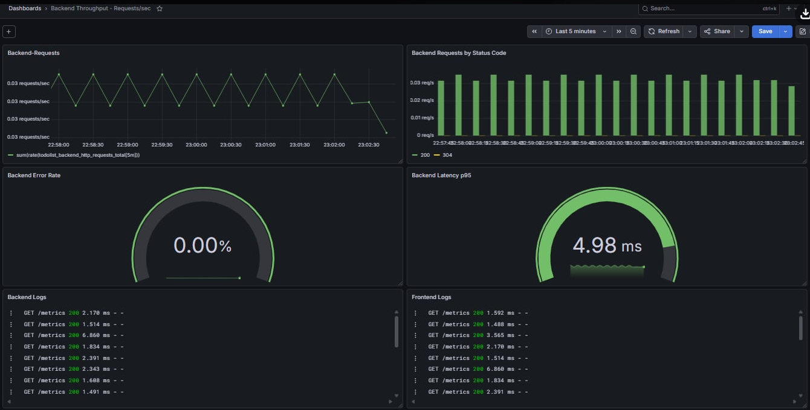

<h1 align="center">🚀 3-Tier Application Deployment on AWS</h1>

<h3 align="center">
CI/CD • Docker • Kubernetes Kind • PostgreSQL • Prometheus • Grafana • Loki
</h3>

End-to-end DevOps project for deploying a 3-tier To-Do List application on AWS with automated CI/CD, secure infrastructure, and full observability.

---

<h2 align="center">📸 Project Screenshots</h2>

<h3 align="center">🚀 CI/CD Pipeline</h3>

  

  <em>Jenkins CI/CD pipeline for build, test, Docker image publishing, Dev deployment, manual approval, and Production deployment.</em>

---

<h3 align="center">📊 Grafana Monitoring Dashboard</h3>

  

  <em>Grafana dashboard visualizing Prometheus metrics for infrastructure and application monitoring.</em>

---

<h3 align="center">📈 Backend Metrics Endpoint</h3>

  

  <em>Backend metrics endpoint exposed for Prometheus scraping and observability.</em>

---

<h2>📖 Overview</h2>

This project demonstrates an end-to-end DevOps workflow for deploying a 3-tier To-Do List application on AWS.

The system includes:

<ul>
  <li>Frontend application</li>
  <li>Backend API</li>
  <li>PostgreSQL database</li>
  <li>Jenkins CI/CD pipeline</li>
  <li>Docker-based Dev deployment</li>
  <li>Kubernetes Kind Production deployment</li>
  <li>Observability stack with Prometheus, Grafana, Loki, Promtail, Node Exporter, and cAdvisor</li>
</ul>

The main goal is to automate application delivery, separate Dev and Production environments, secure database access, and monitor the system with metrics and logs.

---

<h2>🏗️ Architecture</h2>

The infrastructure is deployed inside a custom AWS VPC.

<pre>
Developer
   ↓
GitHub
   ↓
Jenkins
   ↓
Docker Build
   ↓
Docker Hub
   ↓
Dev Deployment on App EC2
   ↓
Manual Approval
   ↓
Production Deployment on Kubernetes Kind
   ↓
Monitoring with Prometheus, Loki, and Grafana
</pre>

---

<h2>1. Infrastructure Design</h2>

<h3>1.1 Network Architecture</h3>

<ul>
  <li>Custom VPC</li>
  <li>2 Public Subnets across 2 Availability Zones</li>
  <li>2 Private Subnets across 2 Availability Zones</li>
  <li>Internet Gateway for public subnet access</li>
  <li>NAT Gateway for private subnet outbound access</li>
  <li>Public Route Table: <code>0.0.0.0/0 -> Internet Gateway</code></li>
  <li>Private Route Table: <code>0.0.0.0/0 -> NAT Gateway</code></li>
</ul>

<h3>Why this design?</h3>

<ul>
  <li>Public subnets are used for Internet-facing services such as Jenkins, Grafana, and the Dev application server.</li>
  <li>Private subnets are used for the PostgreSQL database to prevent direct Internet access.</li>
  <li>Multi-AZ subnet design improves availability and follows cloud architecture best practices.</li>
  <li>A single NAT Gateway is used in this lab to optimize AWS cost, while production environments should use one NAT Gateway per Availability Zone.</li>
</ul>

---

<h2>2. EC2 Infrastructure</h2>

<table>
  <tr>
    <th>EC2 Instance</th>
    <th>Subnet</th>
    <th>Purpose</th>
  </tr>
  <tr>
    <td>Tools EC2</td>
    <td>Public Subnet</td>
    <td>Jenkins, Prometheus, Grafana, Loki, Kubernetes Kind</td>
  </tr>
  <tr>
    <td>App EC2</td>
    <td>Public Subnet</td>
    <td>Dockerized Frontend and Backend for Dev</td>
  </tr>
  <tr>
    <td>Database EC2</td>
    <td>Private Subnet</td>
    <td>PostgreSQL Database</td>
  </tr>
</table>

<h3>2.1 Why EC2?</h3>

<ul>
  <li>Practice real infrastructure operations</li>
  <li>Linux server administration</li>
  <li>Docker installation and deployment</li>
  <li>Jenkins hosting</li>
  <li>Kubernetes Kind setup</li>
  <li>PostgreSQL deployment</li>
  <li>Monitoring stack configuration</li>
</ul>

<h3>Production Recommendation</h3>

<ul>
  <li>Replace self-managed services with managed services such as Amazon RDS and AWS EKS.</li>
</ul>

---

<h2>3. Security Design</h2>

<h3>3.1 Network Security</h3>

<ul>
  <li>Database EC2 is deployed in a private subnet</li>
  <li>PostgreSQL is not publicly accessible</li>
  <li>Public-facing services are hosted in public subnets</li>
  <li>Private subnet outbound traffic routes through NAT Gateway</li>
</ul>

<h3>3.2 Security Groups</h3>

<table>
  <tr>
    <th>Security Group</th>
    <th>Purpose</th>
  </tr>
  <tr>
    <td>SG-Tools</td>
    <td>Access control for Jenkins, Grafana, Prometheus, Loki</td>
  </tr>
  <tr>
    <td>SG-App</td>
    <td>Application traffic for Frontend and Backend</td>
  </tr>
  <tr>
    <td>SG-DB</td>
    <td>Allows PostgreSQL access only from App EC2 and Production Backend</td>
  </tr>
</table>

<h3>3.3 Credentials Management</h3>

<ul>
  <li>Dev database credentials stored in Jenkins Credentials</li>
  <li>Production database credentials stored in Kubernetes Secrets</li>
  <li>No database passwords committed to GitHub</li>
</ul>

<h3>Why this design?</h3>

<ul>
  <li>Follows the Principle of Least Privilege</li>
  <li>Restricts unnecessary communication</li>
  <li>Protects sensitive credentials from source code exposure</li>
</ul>

---

<h2>4. CI/CD Pipeline</h2>

<h3>4.1 Pipeline Flow</h3>

<ol>
  <li>Checkout Source Code</li>
  <li>Build Docker Images</li>
  <li>Run Tests</li>
  <li>Push Images to Docker Hub</li>
  <li>Deploy to Dev</li>
  <li>Manual Approval</li>
  <li>Deploy to Production</li>
</ol>

<h3>4.2 Why Jenkins?</h3>

<ul>
  <li>Widely used CI/CD automation tool</li>
  <li>Provides full control over build, testing, deployment, credentials, and approval workflows</li>
</ul>

<h3>4.3 Benefits</h3>

<ul>
  <li>Reduces manual deployment effort</li>
  <li>Standardizes deployment process</li>
  <li>Detects errors earlier</li>
  <li>Supports manual approval before Production</li>
  <li>Secures credentials using Jenkins Credentials</li>
</ul>

---

<h2>5. Docker Deployment</h2>

<h3>5.1 Containerization</h3>

<ul>
  <li>Frontend and Backend are packaged as Docker images</li>
</ul>

<h3>5.2 Why Docker?</h3>

<ul>
  <li>Ensures environment consistency</li>
  <li>The same image can be used in Dev on App EC2 and Production on Kubernetes Kind</li>
</ul>

<h3>5.3 Benefits</h3>

<ul>
  <li>Consistent runtime environment</li>
  <li>Easier deployment</li>
  <li>Easier rollback using image tags</li>
  <li>Better CI/CD integration</li>
  <li>Application dependencies are packaged with the application</li>
</ul>

---

<h2>6. Development Environment Deployment</h2>

<h3>6.1 Deployment Flow</h3>

<pre>
Jenkins
   ↓ SSH
App EC2
   ↓
Pull Docker Images
   ↓
Run Frontend and Backend Containers
   ↓
Backend connects to PostgreSQL
</pre>

---

<h2>7. Production Deployment with Kubernetes Kind</h2>

<h3>7.1 Overview</h3>

<ul>
  <li>Production environment runs on Kubernetes Kind inside Tools EC2</li>
  <li>Kind stands for Kubernetes in Docker</li>
  <li>Used for cost-efficient Kubernetes practice</li>
</ul>

<h3>7.2 Kubernetes Objects</h3>

<table>
  <tr>
    <th>Object</th>
    <th>Purpose</th>
  </tr>
  <tr>
    <td>Namespace</td>
    <td>Resource isolation</td>
  </tr>
  <tr>
    <td>ConfigMap</td>
    <td>Store non-sensitive configuration</td>
  </tr>
  <tr>
    <td>Secret</td>
    <td>Store database credentials</td>
  </tr>
  <tr>
    <td>Deployment</td>
    <td>Manage Frontend and Backend Pods</td>
  </tr>
  <tr>
    <td>Service</td>
    <td>Internal Pod communication</td>
  </tr>
  <tr>
    <td>NodePort</td>
    <td>External Frontend access</td>
  </tr>
</table>

<h3>7.3 Production Flow</h3>

<pre>
Docker Hub
   ↓
Kubernetes Deployment
   ↓
Frontend Pod
   ↓
Backend Service
   ↓
Backend Pod
   ↓
PostgreSQL on Database EC2
</pre>

<h3>7.4 Why Kubernetes Kind?</h3>

<ul>
  <li>Practice Kubernetes without managed service cost</li>
  <li>Supports Pods, Deployments, Services, ConfigMaps, and Secrets</li>
</ul>

<h3>7.5 Benefits</h3>

<ul>
  <li>Production-like workflow</li>
  <li>Pod self-healing</li>
  <li>Easier application updates</li>
  <li>Preparation for migration to AWS EKS</li>
</ul>

<h3>7.6 Limitation</h3>

<ul>
  <li>Suitable for lab and demo environments only</li>
  <li>AWS EKS is recommended for real production workloads</li>
</ul>

---

<h2>8. Observability Stack</h2>

<h3>8.1 Components</h3>

<ul>
  <li>Prometheus</li>
  <li>Grafana</li>
  <li>cAdvisor</li>
  <li>Node Exporter</li>
  <li>Loki</li>
  <li>Promtail</li>
  <li>Log Generator</li>
</ul>

<h3>8.2 Exposed Ports</h3>

<table>
  <tr>
    <th>Service</th>
    <th>Port</th>
  </tr>
  <tr>
    <td>Grafana</td>
    <td>3000</td>
  </tr>
  <tr>
    <td>Prometheus</td>
    <td>9090</td>
  </tr>
  <tr>
    <td>cAdvisor</td>
    <td>8080</td>
  </tr>
  <tr>
    <td>Node Exporter</td>
    <td>9100</td>
  </tr>
  <tr>
    <td>Loki</td>
    <td>3100</td>
  </tr>
  <tr>
    <td>Promtail</td>
    <td>9080</td>
  </tr>
</table>

---

<h2>9. Metrics and Logging Flow</h2>

<h3>9.1 Metrics Flow</h3>

<pre>
Node Exporter
cAdvisor
Backend /metrics
   ↓
Prometheus
   ↓
Grafana
</pre>

<h3>9.2 Logs Flow</h3>

<pre>
Application Logs
Docker Container Logs
System Logs
   ↓
Promtail
   ↓
Loki
   ↓
Grafana
</pre>

---

<h2>10. Monitoring Tools Explanation</h2>

<h3>10.1 Prometheus</h3>

Prometheus is used for metrics collection and storage.

<h4>Example Metrics</h4>

<ul>
  <li>CPU usage</li>
  <li>Memory usage</li>
  <li>Disk usage</li>
  <li>Request count</li>
  <li>Error rate</li>
  <li>API latency</li>
</ul>

<h3>10.2 Node Exporter</h3>

Node Exporter collects host-level metrics from EC2 instances.

<h4>Monitors</h4>

<ul>
  <li>CPU</li>
  <li>RAM</li>
  <li>Disk</li>
  <li>Network</li>
</ul>

<h3>10.3 cAdvisor</h3>

cAdvisor collects container-level metrics.

<h4>Monitors</h4>

<ul>
  <li>Container CPU usage</li>
  <li>Container memory usage</li>
  <li>Container network traffic</li>
  <li>Container status</li>
</ul>

<h3>10.4 Loki</h3>

Loki stores and queries logs.

<h4>Purpose</h4>

<ul>
  <li>Investigate failures</li>
  <li>Centralized log management</li>
</ul>

<h3>10.5 Promtail</h3>

Promtail collects logs from containers and system logs, then forwards them to Loki.

<h3>10.6 Grafana</h3>

Grafana is the visualization platform connected to Prometheus for metrics and Loki for logs.

<h4>Benefits</h4>

<ul>
  <li>Centralized dashboards</li>
  <li>Real-time visibility</li>
  <li>Easier debugging</li>
  <li>Unified metrics and logs</li>
</ul>

---

<h2>11. Useful Commands</h2>

<h3>11.1 Start Observability Stack</h3>

<pre><code>docker-compose up -d</code></pre>

<h3>11.2 View Running Containers</h3>

<pre><code>docker ps</code></pre>

<h3>11.3 View Service Logs</h3>

<pre><code>docker-compose logs -f</code></pre>

<h3>11.4 Stop Services</h3>

<pre><code>docker-compose down</code></pre>

<h3>11.5 Remove Services and Volumes</h3>

<pre><code>docker-compose down -v</code></pre>

<h3>11.6 Restart Prometheus</h3>

<pre><code>docker-compose restart prometheus</code></pre>

---

<h2>12. Grafana Dashboards</h2>

<table>
  <tr>
    <th>Dashboard</th>
    <th>Purpose</th>
  </tr>
  <tr>
    <td>Node Exporter Full</td>
    <td>EC2 metrics</td>
  </tr>
  <tr>
    <td>Docker Container Metrics</td>
    <td>Container resource usage</td>
  </tr>
  <tr>
    <td>cAdvisor Dashboard</td>
    <td>Container monitoring</td>
  </tr>
  <tr>
    <td>Loki Logs Dashboard</td>
    <td>Centralized logs</td>
  </tr>
  <tr>
    <td>Application Dashboard</td>
    <td>Request count, latency, error rate</td>
  </tr>
</table>

<h3>12.1 Example Dashboard IDs</h3>

<ul>
  <li>Node Exporter Full: 1860</li>
  <li>Docker Container & Host Metrics: 179</li>
  <li>cAdvisor: 893</li>
  <li>Loki Stack Monitoring: 14055</li>
  <li>Loki Logs Dashboard: 13639</li>
  <li>Container Logs: 15141</li>
</ul>

---

<h2>13. Project Achievements</h2>

<h3>13.1 Infrastructure</h3>

<ul>
  <li>AWS VPC with public/private subnet architecture</li>
  <li>Internet Gateway and NAT Gateway</li>
  <li>Route Tables</li>
  <li>EC2 infrastructure for tools, app, and database</li>
</ul>

<h3>13.2 Security</h3>

<ul>
  <li>Security Group isolation</li>
  <li>Database protection in private subnet</li>
  <li>Credential management</li>
</ul>

<h3>13.3 DevOps & Deployment</h3>

<ul>
  <li>Dockerized Frontend and Backend</li>
  <li>Jenkins CI/CD Pipeline</li>
  <li>Docker Hub integration</li>
  <li>Dev deployment using Docker</li>
  <li>Production deployment using Kubernetes Kind</li>
</ul>

<h3>13.4 Kubernetes</h3>

<ul>
  <li>Namespace</li>
  <li>ConfigMap</li>
  <li>Secret</li>
  <li>Deployment</li>
  <li>Service</li>
  <li>NodePort</li>
</ul>

<h3>13.5 Monitoring & Logging</h3>

<ul>
  <li>Prometheus metrics collection</li>
  <li>Loki log aggregation</li>
  <li>Promtail log shipping</li>
  <li>Grafana dashboards</li>
</ul>

---
